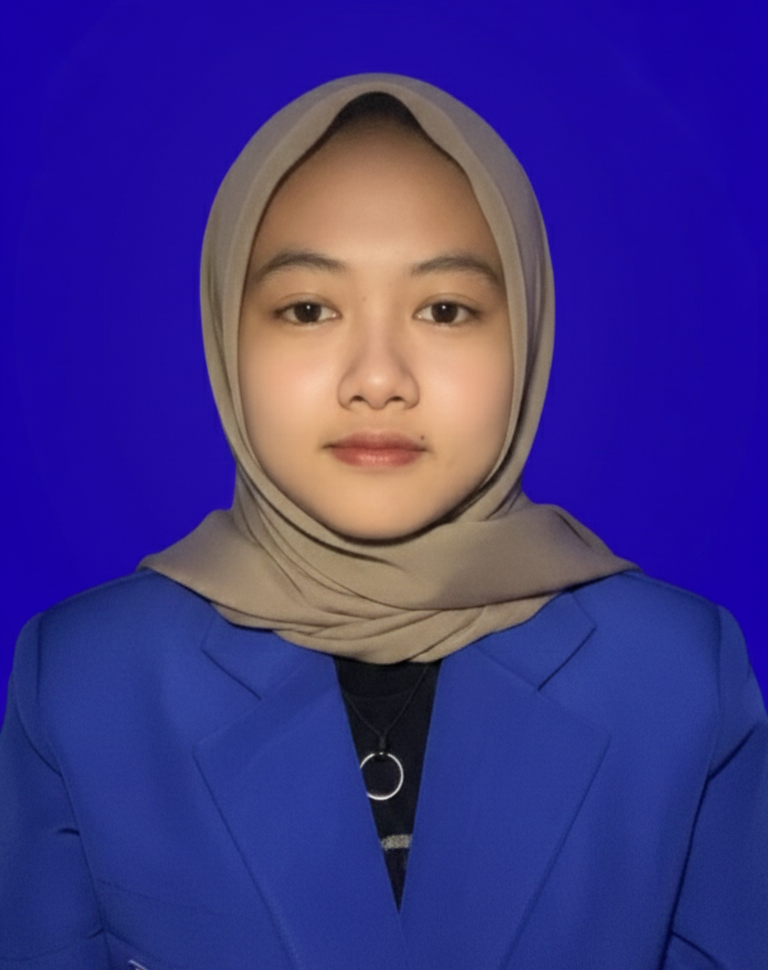
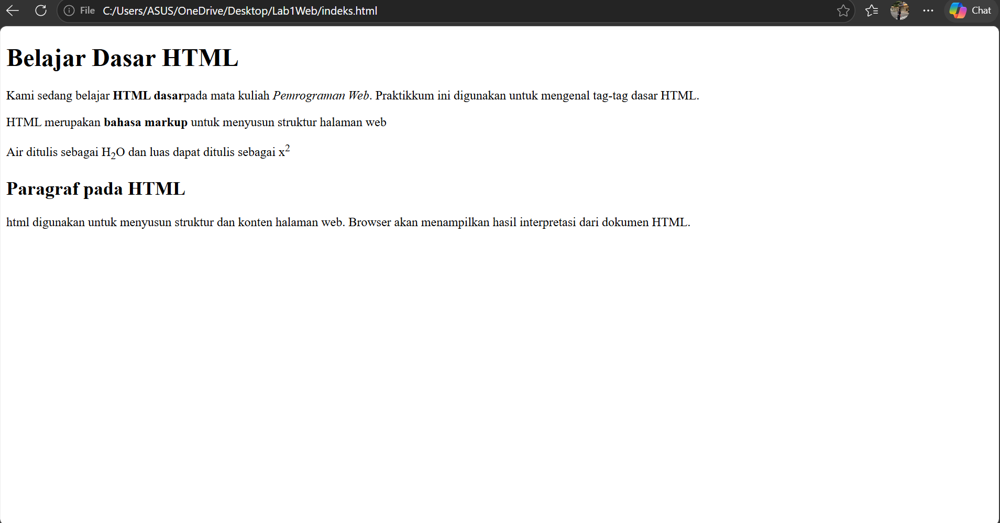
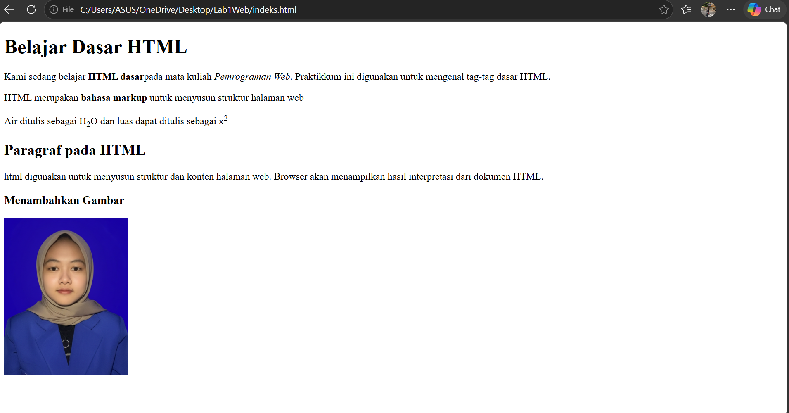
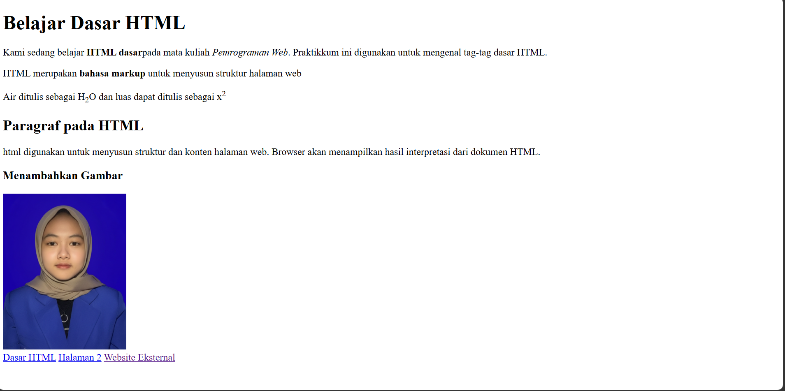
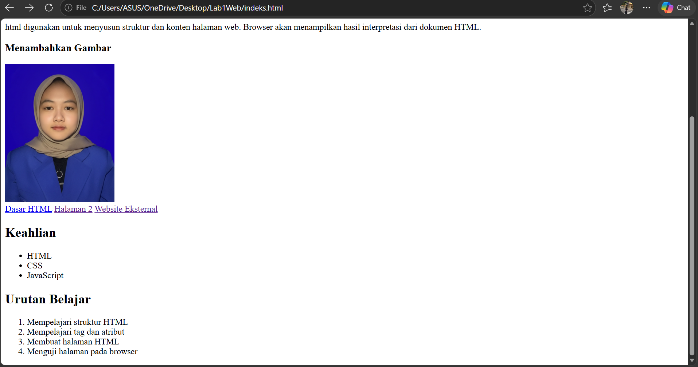
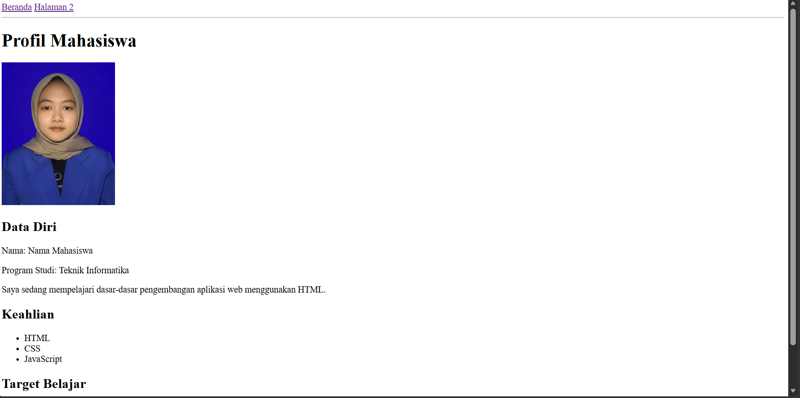
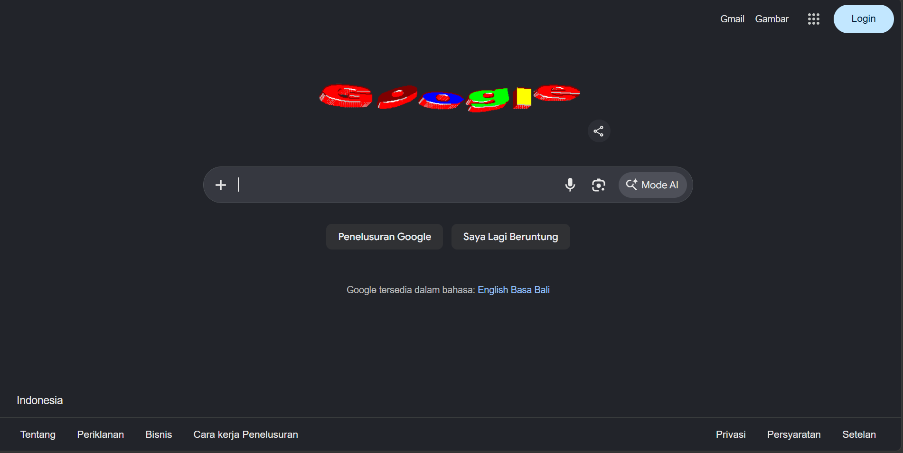

 # LAPORAN PRAKTIKUM PEMROGRAMAN WEB

 ## Praktikum HTML Dasar

 ### Identitas Mahasiswa

 | Keterangan | Data |
 | --- | --- |
 | Nama | Naysila Rahil Maulana |
 | NIM | 312510143 |
 | Program Studi | Teknik Informatika |

 ### Foto Mahasiswa

 

 ### 1. Tujuan Praktikum

 1. Mengenal struktur dasar dokumen HTML.
 2. Memahami penggunaan tag heading, paragraf, daftar, tautan, dan gambar.
 3. Membuat halaman web sederhana menggunakan HTML.

 ### 2. Alat dan Bahan

 - Visual Studio Code
 - Browser web
 - HTML
 - File gambar `image/fotomahasiswa.png`

 ### 3. Langkah Kerja

 1. Membuat file `indeks.html` sebagai halaman utama.
 2. Menambahkan struktur HTML yang terdiri dari `html`, `head`, dan `body`.
 3. Menambahkan judul, paragraf, heading, daftar keahlian, dan urutan belajar.
 4. Menampilkan foto menggunakan tag ``.
 5. Membuat navigasi menuju halaman utama, halaman kedua, dan situs eksternal.
 6. Membuat file `halaman2.html` yang berisi profil mahasiswa.
 7. Membuka file HTML melalui browser untuk melihat hasilnya.

 ### 4. Hasil Praktikum

 Praktikum menghasilkan dua halaman web:

 - `indeks.html` berisi materi dasar HTML, gambar, navigasi, dan daftar.
 - `halaman2.html` berisi profil, data diri, keahlian, dan target belajar mahasiswa.

 ### Dokumentasi Perubahan Kode

 Berikut adalah screenshot perubahan tampilan web sesuai urutan pembaruan kode:

 #### Perubahan 1

 

 #### Perubahan 2

 

 #### Perubahan 4

 

 #### Perubahan 5

 

 #### Perubahan 6

 

 #### Tampilan Website Eksternal

 

 Foto pada halaman HTML ditampilkan dengan kode berikut:

 ```html
 
 ```

 ### 5. Kesimpulan

 HTML digunakan untuk menyusun struktur dan konten halaman web. Melalui praktikum ini,
 saya memahami penggunaan tag dasar HTML, cara menampilkan gambar, dan cara membuat
 navigasi sederhana antarhalaman.
